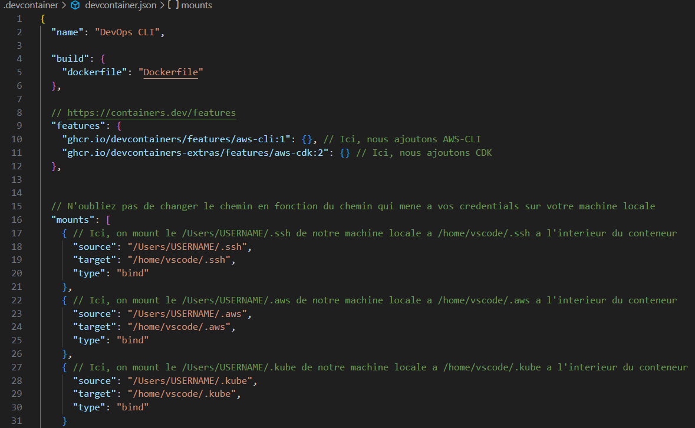
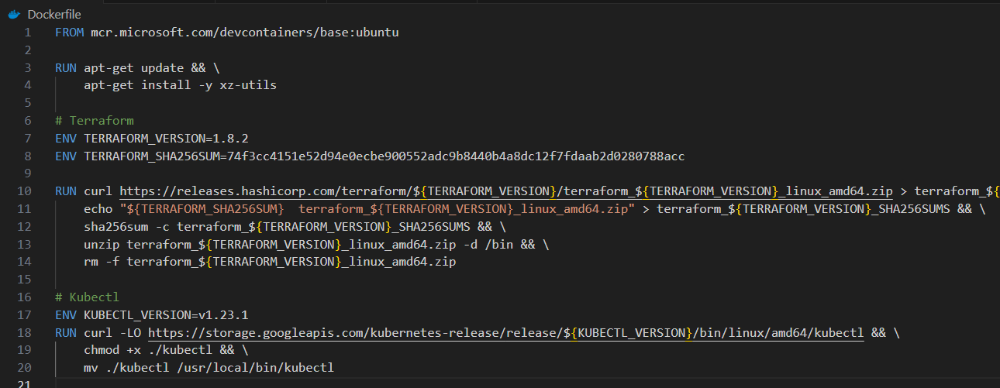
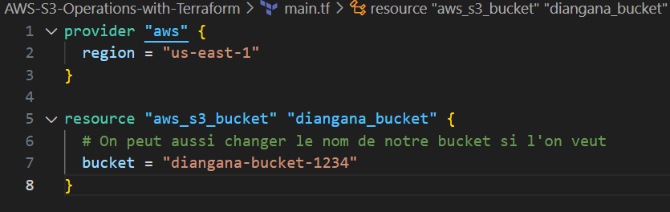

# _`DevContainers pour MLOps / DevOps avec VS Code`_

Ce dépôt montre comment mettre en place un environnement de développement **reproductible, cohérent et efficace** pour les ingénieurs MLOps et DevOps à l’aide des **DevContainers** dans Visual Studio Code.  

L’objectif est de garantir que chaque membre d’une équipe dispose exactement des mêmes outils, avec les mêmes versions et configurations, quel que soit son système d’exploitation (Linux, macOS, Windows).  

---

## _`Pourquoi utiliser des DevContainers ?`_

Dans une configuration classique, chaque développeur installe localement des outils comme AWS CLI, Terraform, CDK, Kubectl, Git, Python, etc.  
Cela entraîne souvent :  
- des différences de versions entre machines,  
- des incohérences de configuration entre coéquipiers,  
- une complexité accrue lors de l’onboarding de nouveaux développeurs.  

Avec les **DevContainers**, tous les outils sont packagés dans un environnement basé sur Docker. Chaque développeur utilise ainsi exactement la même stack, ce qui garantit la cohérence et la reproductibilité.

---

## _`Outils disponibles dans cet environnement`_

- AWS CLI (v2.13.30)  
- Terraform (v1.8.2)  
- AWS CDK (v2.103.1)  
- Kubectl (v1.23.1)  
- Python 3  
- Git  
- Go  
- Ruby 3  

---

## _`Structure du projet`_

```bash
.
├── .devcontainer/
│ ├── devcontainer.json
│ └── Dockerfile
├── main.tf
└── README.md
```


- **devcontainer.json** : fichier de configuration du DevContainer  
- **Dockerfile** : définition de l’image avec Terraform, Kubectl, etc.  
- **main.tf** : script Terraform simple pour valider l’environnement (création d’un bucket S3)  

---

## _`Mise en place du DevContainer`_

### _`1. Installer l’extension Dev Containers`_
Dans VS Code, installer l’extension :  
`Dev Containers`  

### 2. Fichier `devcontainer.json`



Cette configuration monte vos credentials locaux (AWS, SSH, Kubernetes) dans le conteneur, afin qu’ils soient utilisables directement dans l’environnement de développement.


### 3. Fichier `Dockerfile`



---

# _`Validation de l’environnement`_

Pour tester la configuration, un script Terraform (`main.tf`) permet de créer un bucket S3 :



## _`Commandes de test`_

```bash
terraform init
terraform plan
terraform apply
```


# _`Personnalisation`_

Le fichier `devcontainer.json` est entièrement extensible.
Vous pouvez ajouter :

 - d’autres CLIs (Helm, Ansible, Docker, etc.),

 - différentes versions de langages (Python, Ruby, Node.js…),

 - des outils spécifiques à vos projets.

Il suffit de les ajouter en tant que features ou via le `Dockerfile`.

---

# _`Conclusion`_

Avec DevContainers, il est possible de :

 - garantir la cohérence entre développeurs et systèmes d’exploitation,

 - accélérer l’onboarding,

 - simplifier la gestion des outils,

 - assurer la reproductibilité des environnements.

Cette approche est particulièrement adaptée pour les ***MLOps Engineers, DevOps Engineers, Platform Engineers, Cloud Engineers et Software Engineers*** travaillant en équipe ou sur des projets collaboratifs.

---

# _`Ressources utiles`_

[Documentation DevContainers](https://containers.dev/)

[Extension VS Code Dev Containers](https://marketplace.visualstudio.com/items?itemName=ms-vscode-remote.remote-containers)

[Terraform](https://developer.hashicorp.com/terraform)

[AWS CLI](https://docs.aws.amazon.com/cli/)

---

# _`Auteur`_

_Mahamadou Diangana – Data Scientist | MLOps Engineer | AWS Cloud Solutions Enthusiast_

